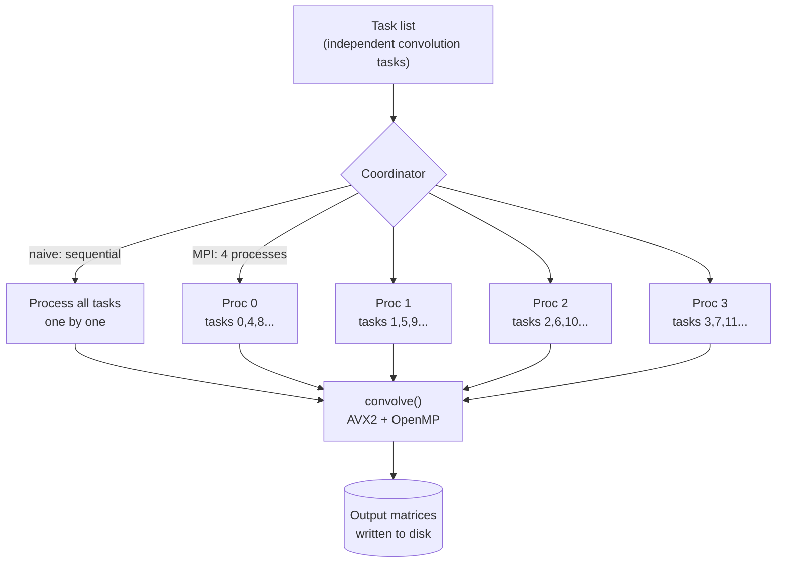

# Parallel 2D Convolution Optimizer

> A high-performance 2D convolution engine in C for grayscale image/video processing (Gaussian blur and sharpen), progressively optimized with **AVX2 SIMD**, **OpenMP** multithreading, and **Open MPI** multiprocessing — reaching a **9.16× speedup** over the naive baseline.


---

## Table of Contents
- [Overview](#overview)
- [Platform Requirements](#platform-requirements)
- [Optimizations](#optimizations)
- [Architecture](#architecture)
- [Build & Run](#build--run)
- [Performance](#performance)
- [What I Learned](#what-i-learned)

---

## Overview

This project implements **2D convolution** — the core operation behind image filters like
Gaussian blur and sharpening — and then optimizes it through three successive layers of
parallelism. Each grayscale video frame is treated as a matrix of pixel values, and
convolving it with a small kernel produces the filtered output.

The work is structured as a set of independent **tasks** (each task convolves a pair of
matrices and writes the result to disk), dispatched by a **coordinator**. The project
ships multiple implementations of both the compute kernel and the coordinator, so you can
compare a naive baseline against increasingly parallel versions.

---

## Platform Requirements

> ⚠️ **This project runs only on x86-64 machines.**
>
> The optimized kernel uses **AVX2 SIMD intrinsics** (`x86intrin.h`, `_mm256_*`), which
> exist only on x86-64 CPUs. It was built for and tested on the **Berkeley `hive`
> machines**, and will run on any x86-64 Linux system with the right toolchain. It will
> **not** compile on ARM CPUs (e.g. Apple Silicon M1/M2/M3), because AVX2 is not available
> on that architecture.

**Toolchain needed:**
- An x86-64 Linux environment (hive machine, x86 cloud VM, WSL2, or x86 Docker container)
- `gcc` with OpenMP support
- Open MPI (`mpicc`, `mpirun`) for the distributed build

---

## Optimizations

The kernel is optimized in three stages, each building on the last:

| Stage | Technique | What it does |
|-------|-----------|--------------|
| **1. SIMD** | AVX2 intrinsics | Processes **8 `int32` elements per instruction** using 256-bit vectors, with explicit tail handling for leftover elements |
| **2. Multithreading** | OpenMP | Parallelizes the convolution across CPU cores (`parallel for`, `collapse(2)`, `schedule(dynamic)`) |
| **3. Multiprocessing** | Open MPI | Distributes independent tasks across **4 processes** via round-robin assignment |

The SIMD and OpenMP stages give the headline **9.16× speedup** on a single machine; the
MPI stage adds task-level parallelism on top, distributing the workload across processes.

---

## Architecture

The system separates **what to compute** (the convolution kernel) from **how work is
dispatched** (the coordinator), so the two can be optimized independently.



**Components:**

| File | Role |
|------|------|
| `compute_naive.c` | Baseline convolution (triple-nested loops) |
| `compute_optimized.c` | AVX2 SIMD + OpenMP convolution (the 9.16× version) |
| `compute_optimized_mpi.c` | Same optimized kernel, used by the MPI build |
| `coordinator_naive.c` | Runs all tasks sequentially in one process |
| `coordinator_mpi.c` | Distributes tasks across MPI processes (round-robin) |

Because every task reads its own inputs and writes its own output file, the tasks are
**fully independent** — so the MPI coordinator needs no inter-process communication. Each
process simply executes its slice of the task list. Round-robin assignment (rather than
contiguous blocks) spreads large and small tasks evenly across processes for better load
balancing.

---

## Build & Run

> Run on an x86-64 Linux machine (see [Platform Requirements](#platform-requirements)).

The Makefile exposes a target per stage. `TEST` points to a test directory.

```bash
# Stage 1 — naive baseline
make task_1 TEST=tests/test_large

# Stage 2 — AVX2 SIMD + OpenMP
make task_2 TEST=tests/test_large

# Stage 3 — optimized + Open MPI (4 processes)
make task_3 TEST=tests/test_large
```

The MPI target compiles the coordinator with `mpicc` and launches it with
`mpirun -np 4`.

---

## Performance

Measured on the x86-64 hive machines against the naive baseline:

| Implementation | Speedup vs naive |
|----------------|------------------|
| SIMD + OpenMP (`task_2`) | **9.16×** |
| + Open MPI (`task_3`) | additional task-level parallelism across 4 processes |

To reproduce on your own machine, time the same test across stages:

```bash
time make task_2 TEST=tests/test_large
time make task_3 TEST=tests/test_large
```

Speedup = (baseline time) ÷ (optimized time). Results vary with machine load and core count.

---

## What I Learned

- **Three flavors of parallelism, and when each applies** — SIMD (data-level, within one
  core), OpenMP (thread-level, shared memory within one machine), and MPI (process-level,
  separate memory across processes). Seeing all three stack on the same problem made the
  distinctions concrete.
- **Why independent work parallelizes cleanly** — because each task is self-contained, the
  MPI version needs zero communication, which is the ideal case for distributed speedup.
- **Load balancing matters** — round-robin task assignment beats contiguous blocks when
  tasks vary in size, because it prevents any one process from getting stuck with all the
  heavy work.
- **Vectorizing real code is fiddly** — handling tail cases (elements that don't fill a
  full 256-bit vector) correctly was as important as the vectorized fast path itself.
